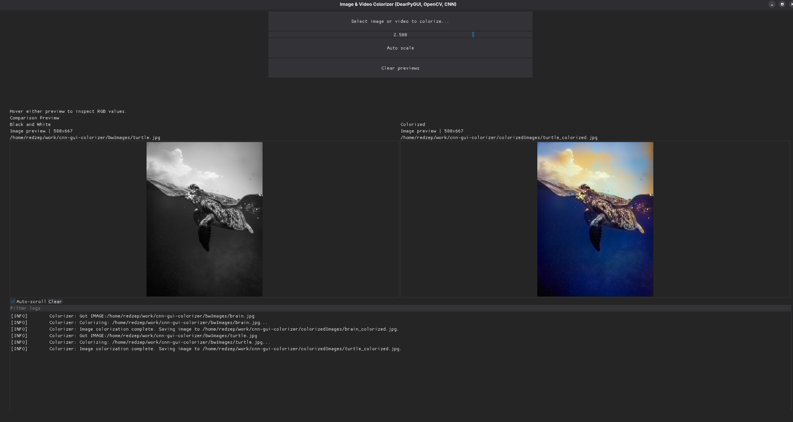
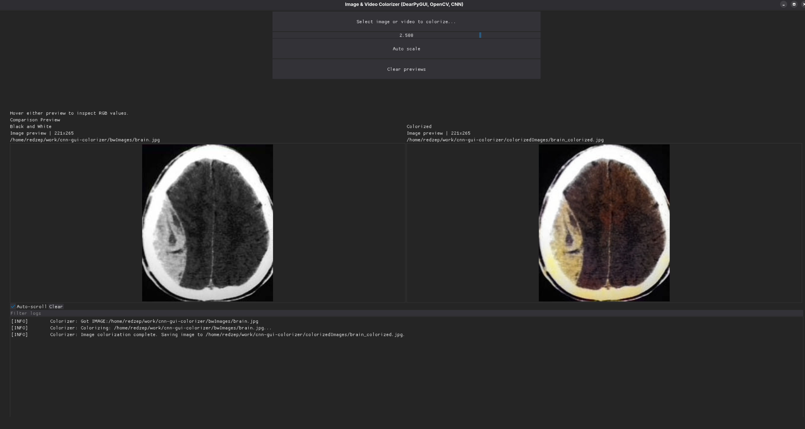

# Colorizer GUI using CNNs
An app using a neural network approach to colorize images and videos.
<br>
The application (the neural net rather) "hallucinates" possible colors (so an acceptable result is a probable result, not necessarily the real truth).
<br>
GUI written in [DearPyGui](https://github.com/hoffstadt/DearPyGui) to allow a pleasant user experience.

## Installation & Usage
1. Clone this repository
2. Other packages that you need can be installed with:
   - ```sudo apt install python3-tk python3-dev python3-pip```
3. Execute ```pip3 install -r requirements.txt``` to download all necessary libraries
4. Fetch the model assets if they are missing:

```bash
python3 scripts/download_model.py
```

Manual model download: [Colorization Release v2 Caffemodel](https://drive.google.com/file/d/1HWgaWDZjR1pSWqUBg0TzmbiVjq5WtnIi/view?usp=drive_link)

5. Execute with ```python3 main.py``` or ```./main.py```

The Caffe model is intentionally not tracked in git. The helper script downloads the missing weights into `./model` by default.

Sample input media lives under `./examples`, and generated media is written under `./outputs`.

If you want to keep the model somewhere else, point the app at it with `COLORIZER_MODEL_DIR`:

```bash
COLORIZER_MODEL_DIR=/path/to/model python3 main.py
```

### UI Scaling
The app auto-scales its UI on large displays and also exposes a `UI scale` slider in the main window.

If you want to force a specific scale from the shell, set `COLORIZER_UI_SCALE` before startup:

```bash
COLORIZER_UI_SCALE=1.6 python3 main.py
```

### Media Preview
Image preview and video preview run entirely inside DearPyGUI. No external viewers such as `sxiv`, `mpv`, or `scrot` are required.

The preview is shown side by side: black and white on the left, colorized output on the right.

The video preview is frame-based and muted. DearPyGUI does not expose a dedicated video player widget, so playback is implemented by updating textures inside the GUI.

If the model weights are missing, the app opens a modal dialog with a `Download model` action and a copyable manual download URL.

## Packaging
### Process Name
When you run the app from source, it makes a best-effort attempt to rename the process to `cnn-colorizer`. That helps on Linux process lists that respect the kernel process name, but some desktop system monitors still prefer the executable name or command line and may continue to show `python3`.

If you need the name to show up reliably as `cnn-colorizer`, build and run the native binary. In that case the executable name is the process name.

### Native Binary Builds
Install the build dependency:

```bash
pip3 install -r requirements-build.txt
```

Build the distributable bundle:

```bash
python3 scripts/build_binary.py --clean
```

The output is written to `dist/cnn-colorizer/`. The packaged app includes the lightweight model metadata files and downloads the `colorization_release_v2.caffemodel` on demand through the in-app model dialog.

The packaged app also includes the sample images and videos from this repository under `examples/bwImages` and `examples/bwVideos`. The file picker opens there automatically when those examples are present.

Build native bundles on the target OS. Portable release bundles are currently produced for Linux and Windows. On macOS, run the app from source for now.

### GitHub Releases
The repository includes a GitHub Actions workflow at `.github/workflows/release.yml`.

- Publishing a GitHub release builds portable archives for Linux and Windows.
- The release assets are uploaded to the GitHub release page automatically.
- Manual runs from the Actions tab also produce downloadable workflow artifacts.

## Features
-   Colorize images
-   Colorize videos
-   Colorize images & videos at the same time
-   Cancel video colorization if it is taking too long for your liking
-   Video colorization progress bar
-   File picker, no need for program arguments
-   Side-by-side in-app image preview
-   Side-by-side in-app looping video preview
-   RGB information on hover over either preview

## AI Usage
All code before April 13th was developed without AI assistance.
Codex was used (GPT-5.4) for **assistance** in development of this application afterwards.

## Screenshots

<br>


## Resources
- [Zhang, R., Isola, P., & Efros, A. A. (2016). Colorful Image Colorization. ECCV.](https://arxiv.org/pdf/1603.08511.pdf)
- [Zhang, R., Zhu, J.-Y., Isola, P., Geng, X., Lin, A. S., Yu, T., & Efros, A. A. (2017). Real-Time User-Guided Image Colorization with Learned Deep Priors. ACM Transactions on Graphics (TOG), 9(4).](https://arxiv.org/pdf/1705.02999.pdf)
- [Rosebrock A. (2019). Black and white image colorization with OpenCV and Deep Learning](https://pyimagesearch.com/2019/02/25/black-and-white-image-colorization-with-opencv-and-deep-learning/)
- [DearPyGui documentation.](https://dearpygui.readthedocs.io/)
