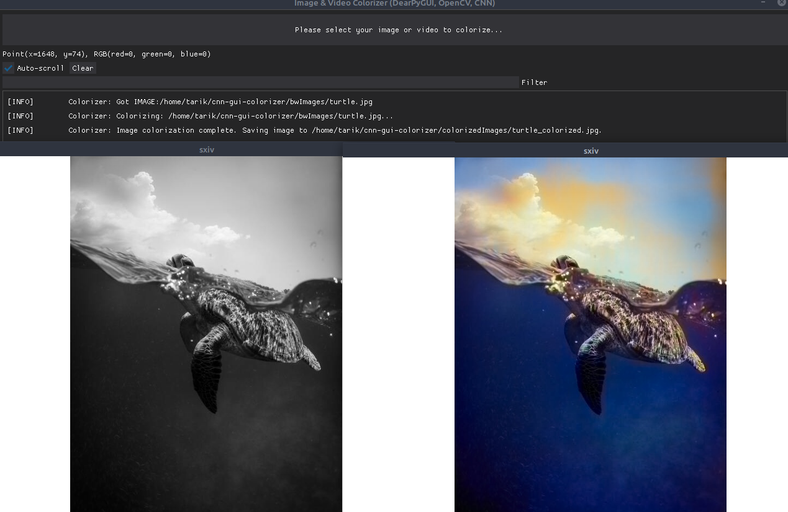
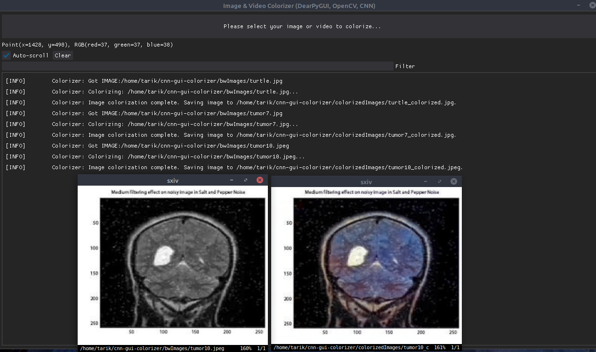

# Colorizer GUI using CNNs
An app using a neural network approach to colorize images and videos.
<br>
The application (the neural net rather) "hallucinates" possible colors (so an acceptable result is a probable result, not necessarily the real truth).
<br>
GUI written in [DearPyGui](https://github.com/hoffstadt/DearPyGui) to allow a pleasant user experience.

## Installation & Usage
1. Clone this repository
2. Download the trained model by executing ```bash getModel.sh``` or ```./getModel.sh```. This will download the necessary files from [R. Zhang's repository and university website.](https://github.com/richzhang/colorization/tree/caffe/colorization) Alternatively you can hunt the files yourself (put them in a folder called ```model```):
    - colorization_deploy_v2.prototxt
    - colorization_release_v2.caffemodel
    - pts_in_hull.npy
3. For video reproduction, you need MPV: [MPV Installation](https://mpv.io/installation/), or quickly for Debian based distros: <br> ```sudo apt install mpv```
4. For displaying images, you need sxiv: ```sudo apt install sxiv```
5. Other packages that you need can be installed with:
   - ```sudo apt install python3-tk python3-dev pip3 scrot```
6. Execute ```pip3 install -r requirements.txt``` to download all necessary libraries
7. Execute with ```python3 main.py``` or ```./main.py```

## Features
-   Colorize images
-   Colorize videos
-   Colorize images & videos at the same time
-   Cancel video colorization if it is taking too long for your liking
-   Video colorization progress bar
-   File picker, no need for program arguments
-   RGB information on mouse hover

## Screenshots

<br>


## Resources
- [Zhang, R., Isola, P., & Efros, A. A. (2016). Colorful Image Colorization. ECCV.](https://arxiv.org/pdf/1603.08511.pdf)
- [Zhang, R., Zhu, J.-Y., Isola, P., Geng, X., Lin, A. S., Yu, T., & Efros, A. A. (2017). Real-Time User-Guided Image Colorization with Learned Deep Priors. ACM Transactions on Graphics (TOG), 9(4).](https://arxiv.org/pdf/1705.02999.pdf)
- [Rosebrock A. (2019). Black and white image colorization with OpenCV and Deep Learning](https://pyimagesearch.com/2019/02/25/black-and-white-image-colorization-with-opencv-and-deep-learning/)
- [DearPyGui documentation.](https://dearpygui.readthedocs.io/)